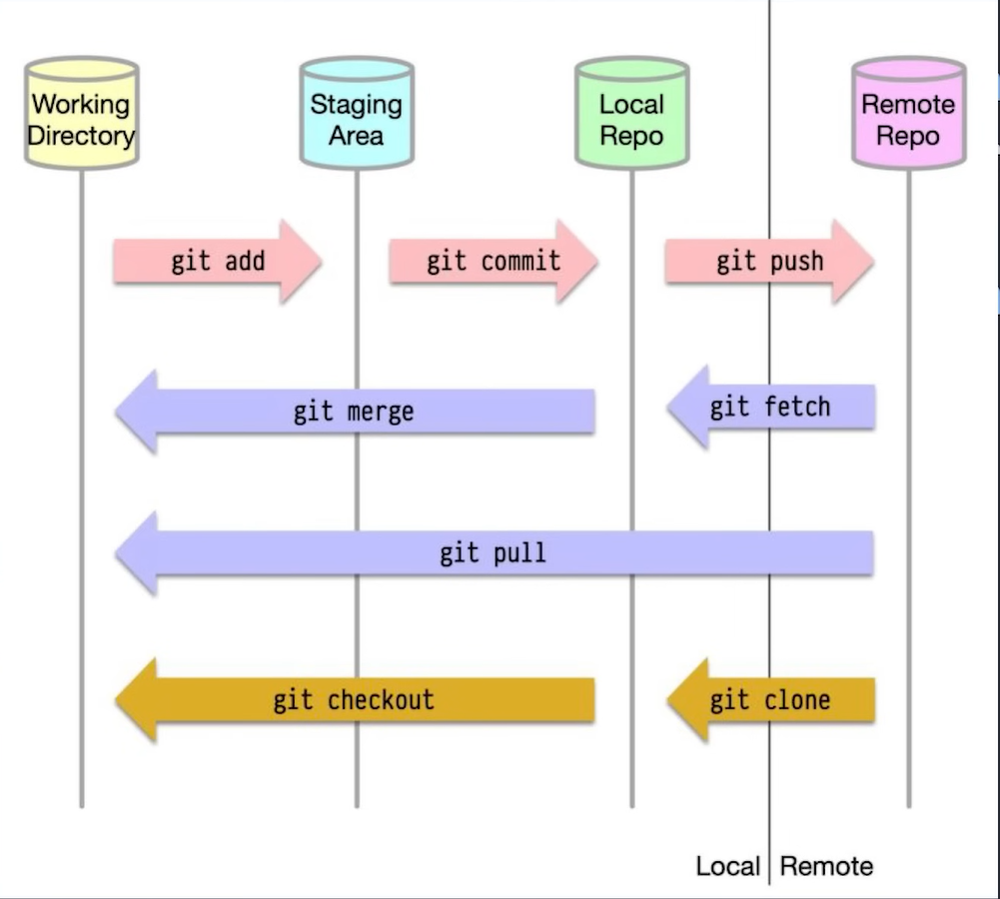

"Git" is an version control sytem

"Version control" is a tool that tracks, manages, and records different versions of files in a special database called a repository.
 
"Repository" stores the file. It act like an database. 

Ex: "Rough_draft.pdf" --> "Rough_draft_v2.pdf"('Some_changes' are made at Rough_draft and save) --> "Rough_draftv3.pdf"('some changes' are made at "Rough_draft_v2" and save)

So if need to use "Rough_draft_v2.pdf" i can use it with the help of version control system because the version control system hold's 
the change's made. So when ever it's required we can "Rollback" to the orginal or previous version.

The repository one in the github is remote repository and the one in machine is local repository.

\\Commands//

1. " git clone" is used to create a local copy of an existing remote repository, including its complete commit history, branches, and files.
2. "git init" Create an empty Git repository or reinitialize an existing one.
3. 